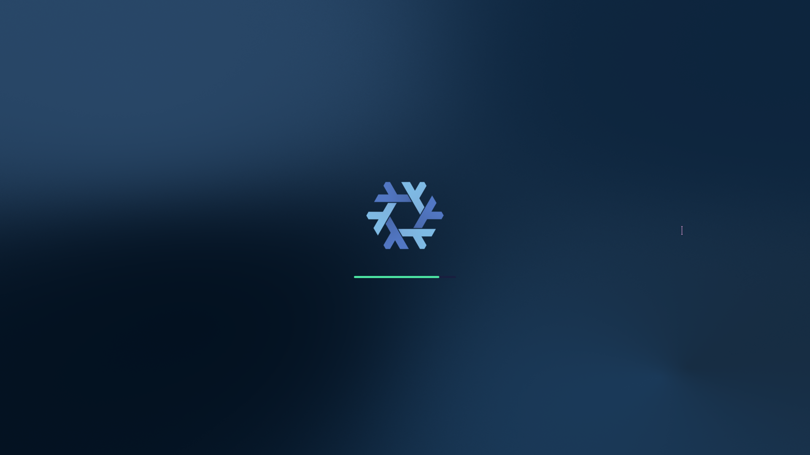
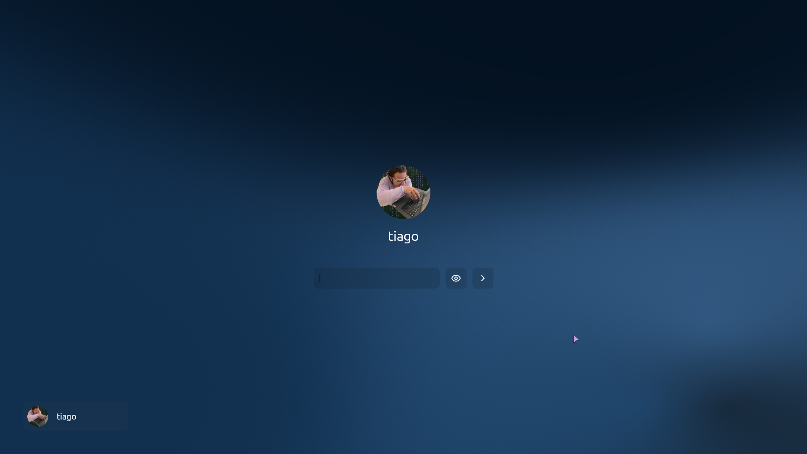

# Tiago's Incredible Boot Screen (TIBS)

**Tiago's Incredible Boot Screen (TIBS)** is a (🚧 Work In Progress) boot animation program and display manager written in Rust. Designed to replace tools like Plymouth, SDDM, and GDM, TIBS delivers a smooth, modern boot experience by rendering animations with OpenGL.

Current state of the UI:



---

## Features

- **Early Boot Animation:**
  Provides a seamless and visually appealing boot screen right from the start of the boot process.

- **Direct DRM Rendering:**
  Uses DRM powered by [Aquamarine](https://github.com/hyprwm/aquamarine) from [Hyprland](https://github.com/hyprwm/Hyprland) instead of relying on a wayland compositor like most display managers which makes it boot up incredibly fast.

- **OpenGL-Powered Graphics:**
  You can throw all your lame plymouth themes, now you can theme your splash screen with custom shaders and crazy animations.

- **Smooth Transition to the Login screen:**
  Since tibs is both a display manager and a splash screen, the transition between the boot animation and the display manager is seemless,
  creating a more polished experience that is impossible to replicate with existing tools.

### Planned Features

- [ ] Manage sessions and make login actually work
- [ ] [hyprlock](https://github.com/hyprwm/hyprlock) replacement
- [ ] Toml configuration
- [ ] Lua theming
---

## Installation

### Building from Source

1. **Clone the Repository:**

   ```bash
   git clone https://github.com/coffeeispower/tibs.git
   cd tibs
   ```

2. **Build with Cargo:**

   ```bash
   cargo build --release
   ```

   The compiled binary will be located at `target/release/tibs`.

---

## NixOS Integration

TIBS includes a built-in NixOS module for easy integration. To activate TIBS on NixOS, import the TIBS NixOS module from the flake and enable it in your configuration:

```nix
{
    # ...
    imports = [
        inputs.tibs.nixosModules.tibs
    ];
    tibs.enable = true;

    # IMPORTANT: Disable all display managers and Plymouth to avoid conflicts.
    services.displayManager.sddm.enable = false;
    services.displayManager.gdm.enable = false;
    services.displayManager.ly.enable = false;
    boot.plymouth.enable = false;

    # Include the appropriate graphics driver in the initramfs.
    # This might be different depending on your gpu and what
    # kind of driver your using
    # This is to prevent tibs from starting with a dummy driver
    # and then crashing when the real driver loads
    boot.initrd.kernelModules = [ "i915" ];
    boot.initrd.systemd.enable = true;

    # OpenGL is, of course, also required for tibs to work properly
    hardware.graphics = {
        enable = true;
        extraPackages = with pkgs; [
            intel-media-driver # LIBVA_DRIVER_NAME=iHD
            libvdpau-va-gl
        ];
    };

    # ...
}
```

This configuration launches TIBS as a systemd service immediately after the initramfs stage which requires some systemd and initramfs
hackery to work properly, so this NixOS module already sets everything up for you.


## License

TIBS is distributed under the AGPL-3.0 License. See the [LICENSE](LICENSE) file for details.

---

## Contact

For issues, feature requests, or contributions, please open an issue on GitHub or contact me at [tiagodinis33@proton.me](mailto:tiagodinis33@proton.me) or chat with me on discord (username: coffeeispower).
